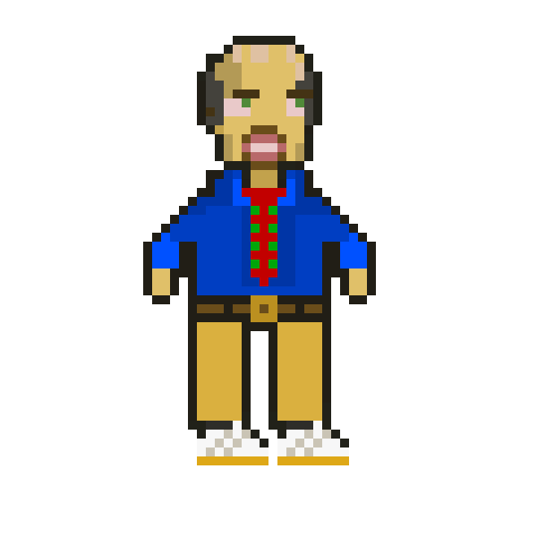

# Mr. Moreson Creative Prototype

A high school 2D pixel-art game prototype exploring interactive narrative and animation through carefully crafted character designs and visual storytelling.

### Character Animation Samples

<table align="center">
  <tr>
    <td align="center">
       
      Mr. Moreson Scissor Attack Animation
    </td>
    <td align="center">
       
      Mrs. Blossom Dialogue Animation
    </td>
  </tr>
</table>

## 📖 Overview

Mr. Moreson Creative Prototype is a 2D pixel-art game project that I co-developed during high school, focusing on the intersection of interactive storytelling and animation design. This repository showcases the creative design work, including character animations and concept documentation that formed the foundation of the game prototype.

## 🎯 Project Goals

The project was designed to explore:

- **Interactive Narrative**: Creating engaging story-driven gameplay through character interactions and environmental storytelling
- **Animation Design**: Developing fluid, expressive pixel-art animations that bring characters to life
- **Visual Storytelling**: Using art and animation to convey emotion, personality, and narrative without extensive dialogue

## 🎨 Creative Direction

As the **Creative Lead** for this project, my primary responsibilities included:

- Character design and conceptualization
- Animation creation and refinement
- Visual style establishment
- Art direction and cohesive aesthetic development

## 📁 Repository Contents

### `/gifs`
Contains animated GIF files showcasing character animations, including:
- Character movement cycles
- Idle animations
- Emotional expressions
- Special actions and interactions

### `/concept-docs`
Houses concept art, design documents, and planning materials that guided the creative process.

## 🛠️ Technical Details

**Art Style**: 2D Pixel Art  
**Format**: Animated GIFs  
**Project Type**: Game Prototype  
**Development Context**: High School Project

## 🎮 Design Philosophy

The project emphasizes:

1. **Character-Driven Storytelling**: Each character's design and animation reflects their personality and role in the narrative
2. **Visual Communication**: Using animation and art to convey story elements that engage players emotionally
3. **Pixel-Perfect Craftsmanship**: Attention to detail in every frame of animation
4. **Narrative Integration**: Ensuring visual elements support and enhance the interactive story

## 📝 Viewing the Animations

The GIF animations can be viewed directly in the `/gifs` folder. Each file represents different aspects of character design and animation work created for the prototype.

## 🎓 Educational Context

This project served as a learning experience in:
- Game design fundamentals
- Digital art creation
- Animation principles
- Project management and creative leadership
- Collaborative storytelling

## 📜 License

This project is licensed under the MIT License - see the [LICENSE](LICENSE) file for details.

## 🤝 Acknowledgments

This project represents early exploration into game development and creative design, showcasing the learning journey and artistic growth during high school.

## 📬 Contact

For questions about this project or to discuss the creative work:
- GitHub: [@amayard27](https://github.com/amayard27)

---

**Note**: This repository primarily contains design assets (animated GIFs and concept documents) from the creative direction role in the project. The prototype demonstrates foundational skills in pixel art, animation, and game design conceptualization.
